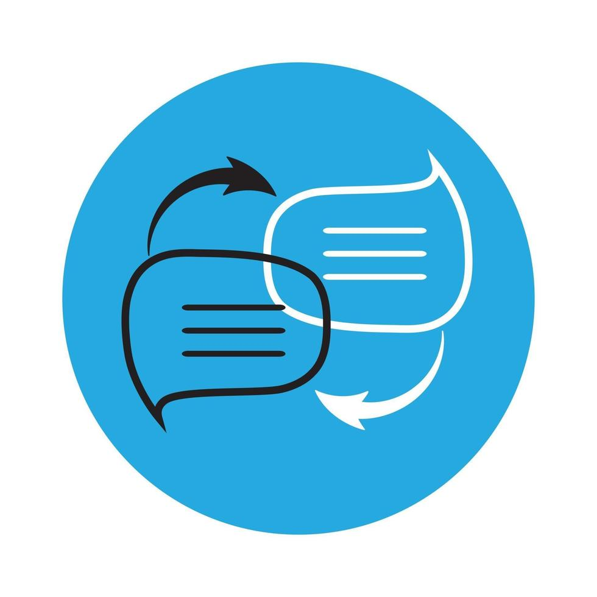

# Breaking Barriers - AI Service Implementation

<h3 align="center">Designed & Developed by:</h3>
<h5 align="center">Anchen Ayres</h5>
<h6 align="center">XD_T300 | Term 3 | 2023</h6>

    

## Table of Contents

- [About The Project](#about-the-project)
  - [Project Description](#project-description)
  - [Built With](#built-with)
- [Getting Started](#getting-started)
  - [Prerequisites](#prerequisites)
  - [How To Install](#how-to-install)
- [Development Process](#development-process)
- [Final Outcomes](#final-outcomes)
- [License](#license)
- [Contact](#contact)
- [Acknowledgements](#acknowledgements)

## About the Project

Welcome to Breaking Barriers, this is a basic translation web application using the MyMemory AI service.

### Project Description

Breaking Barriers is a translation web application which breaks the barrier of language. It allows users to enter any text which they can translate to a range of languages. 

### Built With

- .NET MAUI
- C#
- XAML
- MyMemory Ai 

## Getting Started

The following steps and instructions will guide you through setting up the Breaking Barriers project.

### How to Install

## Breaking Barriers

This project was developed using .NET MAUI.

### Development Environment

1. Clone the AiService_DevTheory repository from [GitHub](https://github.com/anchenayres/AiService_DevTheory.git).
2. Open the solution in Visual Studio.
3. Build the solution to restore NuGet packages and prepare the project files.

### Running the Application

1. Set the startup project to the desired platform (iOS, Android, Windows, etc.).
2. Press the "Run" button or use the IDE's debugging tools to start the application.

### MyMemory AI Setup

1. Sign Up for MyMemory API Access 
- Visit the MyMemory API website (View the acknowledgements for the link).
- Sign up for a free account or log in if you already have one.
- Access the API documentation and guidelines for developers.
2. Generate API Key
- After logging in, navigate to the API section of your account dashboard.
- Create a new API key for your application. This key will be used to authenticate your requests to the MyMemory API.
3. Integrate API Key into the Application
- In your Xamarin Maui project, open the translation service component (e.g., TranslationService.cs).
- Add the API key you generated as a constant or configuration variable in your code.
- Use this API key when making requests to the MyMemory API.

### Adding New Features

1. To enhance Breaking Barriers functionality, add new components by right-clicking on the desired project folder.
2. Choose "Add" > "New Item" and select the appropriate .NET MAUI template.
3. Follow the prompts to configure and implement the new feature.

### Building the Project

1. To build the project, press the "Build" button or use the IDE's build command.
2. The build artifacts will be generated and stored according to the selected platform's output directory.

### Running Tests

Unit Tests: Implement and execute unit tests using the testing tools integrated into .NET MAUI.

### Further Assistance

For more help on .NET MAUI and its development process, refer to the official .NET MAUI documentation.

## Development Process

The Development Process outlines the technical implementations and functionalities integrated into the frontend and backend of the project.

### Implementation Approach

Breaking Barriers leverages the power of .NET MAUI to create a translation web application.

- Utilized .NET MAUI for building the frontend.
- Leveraged C# and XAML to create intuitive interfaces.

### Above and Beyond

To ensure Breaking Barriers was able to provide a seamless experience - I went above and beyond. Using the folloing:

- Reverse Translation implementation which is used for checking translation accuracy. Sometimes, translation engines may not provide a perfect translation, and this feature helps users confirm whether the original meaning is retained after translation and back-translation.
  

### Core Functionalities

#### Translation Page Overview

It is a translation web application using .NET MAUI (or Xamarin) and C# for cross-platform compatibility. It focuses on translation services, allowing users to input text in one language, select a target language, and then translate the text between languages using an external API, possibly the MyMemory API. The app also features a user-friendly interface with flags representing different languages, and users can tap these flags to select their target language for translation. Additionally, there is an option for reverse translation, allowing users to translate back from the target language to the source language. The app uses various UI components, HTTP requests, and styles to provide a seamless translation experience.

#### MyMemory AI Service

The MyMemory API service is utilized for language translation. The TranslationService class integrated this API by sending HTTP GET requests with text to be translated, the source language, and the target language. The API responded with translated text, which was then displayed in your app. This integration allowed your app to provide real-time translation services to users, enhancing its functionality and usability.

### Specific Functionalities

#### Language Translation 

Users can enter text in one language and select a target language for translation. The app utilizes the MyMemory API to translate the text into the chosen language and displays the translated result.

#### Reverse Translation 

Users can also perform reverse translation by clicking the "Translate in Reverse" button. This reverses the translation from the target language back to the source language.

#### Language Selection

Users can choose both the source and target languages from drop-down lists.

#### Flag Selection

Users can tap on flags representing different languages to select the target language for translation.

#### Visual Feedback

When a flag is selected, it is highlighted with a distinct background color, providing visual feedback to the user.

#### Error Handling

The app handles errors gracefully, displaying messages when translation requests fail or when required fields are not filled.

#### User Interface

The user interface is designed with labels, editors, buttons, and images for a user-friendly experience.

#### Styling

The app employs styles for selected and unselected flags to enhance the visual presentation.

#### NuGet Packages

The project may utilize additional NuGet packages for platform-specific functionality.

## Challenges, Highlights & Learnings

### Challenges

The challenges encountered was mostly just understanding how to implement the MyMemory AI Service, it took a lot of time to implement the functionality but once I understood it, the project went smoothly.

### Highlights

A highlight was definitely getting the MyMemory API working and implementing that in my project, seeing everything come together was a great achievement.

### Key Learnings

The experience enriched my understanding of creating an translation AI service through the use of MyMemory AI. 

## Future Enhancements

In the future, I would like to focus on the UI of my project. Although the functionality is working perfectly, it would've looked better with a more comprehensive approach.

Visit the [GitHub repository](https://github.com/anchenayres/AiService_DevTheory.git) for an overview of proposed features and ongoing development (if applicable).

## Author

- **Anchen Ayres** - [anchenayres](https://github.com/anchenayres/AiService_DevTheory.git)

## License

Distributed under the MIT License. See `LICENSE` for more information.

## Contact

- **Project Link** - https://github.com/anchenayres/AiService_DevTheory.git

## Acknowledgements

- [.NET MAUI Documentation](https://docs.microsoft.com/dotnet/maui/)
- [MyMemory AI Documentation](https://mymemory.translated.net/doc/spec.php)
